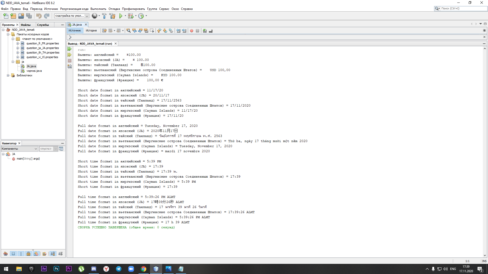

#tema6

| Фамилия, имя студента | Группа    | Дисциплина  |Тема                              
| --------------------- |:---------:| ------------|:--------------------------------:|
| Ногайбай Даулеткерей  | ИС-302    | ООП         |6 Интернационализация приложений |

1-я программа
Вывод в консоли:

Скриншоты кода в NetBeans:

2-я программа
Вывод в консоли:

Скриншоты кода в NetBeans:

